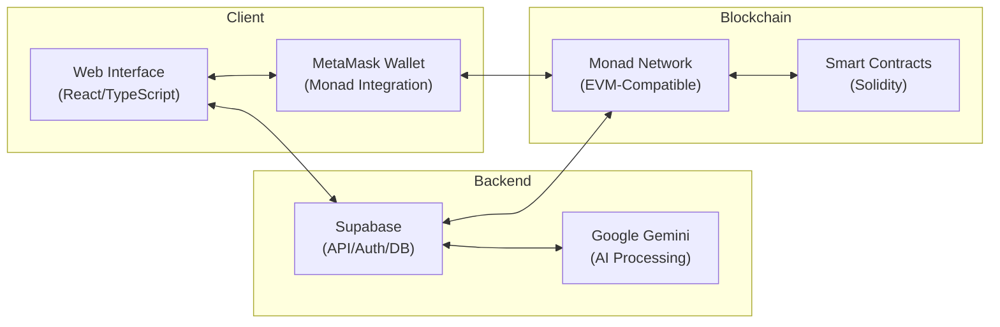
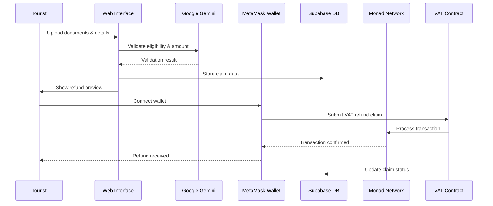
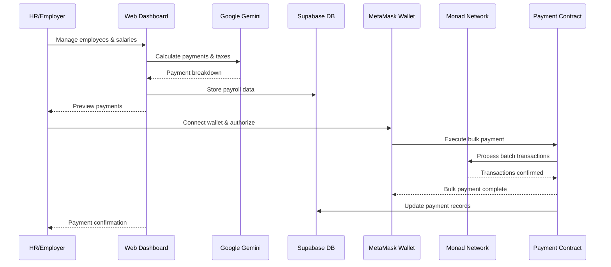

# Orbix


**On-chain VAT Refund Payment Protocol Infrastructure** protecting users against time loss, missed claims in fear of missing flights, and payment failures, powered by **Monad blockchain (EVM-compatible)**.

**Simply means "Helping users to claim VAT Refund Anytime Anywhere without hassling"**

> **Note:** This project was originally built on Aptos blockchain and is currently transitioning to Monad (EVM-compatible). Legacy Aptos code remains in the codebase but is not actively used. MetaMask is used for wallet integration instead of Petra Wallet.

## Prototype

• Landing page
  
   

• Landing page explaining features
  
   

• After clicking wallet, MetaMask asks for confirmation to connect
  
   

• Dashboard
  
   

• VAT refund
  
   

• VAT refund approval
  
   

• MetaMask asking to confirm the transaction
  
   

• Transaction hash on Monad Explorer
  
   

• VAT refund history
  
   

• Employee management
  
   

• Add employee either manually or via bulk CSV
  
   


• Bulk transfer
  
   

• AI assistant
  
   


**On-chain VAT Refund Payment Protocol Infrastructure** protecting users against time loss, missed claims in fear of missing flights, and payment failures, powered by **Monad blockchain (EVM-compatible)**.

**Simply means "Helping users to claim VAT Refund Anytime Anywhere without hassling"**

> **Note:** This project was originally built on Aptos blockchain and is currently transitioning to Monad (EVM-compatible). Legacy Aptos code remains in the codebase but is not actively used. MetaMask is used for wallet integration instead of Petra Wallet.

---

## 💡 Story / Inspiration

**The Problem That Started It All:**
- Travelled to Dubai, bought MAC and BALMAIN clothes worth 1000 AED VAT claim
- Reached DXB airport cutting it close due to Dubai Burj Khalifa traffic  
- Saw a long queue at VAT refund counter, decided to wait - line wasn't moving
- **Result: Missed flight, lost 5000 AED flight ticket = Net Loss 6000 Dirhams**

This isn't just my problem - **it's a global crisis.**

### 📊 The Global Problem
**$200 Billion in VAT Goes Unclaimed Annually** due to:
- Long queues at VAT refund counters (Dubai, Planet, etc.)
- Fear of missing flights
- Forgotten claims or lost receipts  
- Average refund processing time: **10+ days**
- Complex paperwork and bureaucratic delays

These delays cause inconvenience, financial losses, and system failures worldwide.

---

## 🚀 The Solution: ⚡ Orbix

**Helping Masses to:**
- ✅ Claim VAT Refund fully on-chain **anytime, anywhere**
- ✅ **Super Simple, Super Efficient, Super Easy** process
- ✅ **Non-Intrusive**: No additional parameters, code, or complex application processes
- ✅ **Simple Configuration** with maximum impact

**Orbix** is a comprehensive **VAT Refund & Payroll Payment Infrastructure** built on the Monad blockchain that eliminates traditional pain points through:
- **Monad blockchain** with EVM-compatible smart contracts for secure, instant transactions
- **MetaMask integration** for seamless user experience  
- **AI orchestration** (Google Gemini) for automated processing and validation
- **Supabase** for robust backend services and audit trails

---

## 🛑 Problem

- **Tourist VAT Refunds** are slow, manual, and often unclaimed due to airport delays.
- **Global Payroll** is plagued by high fees, delayed wires, hidden FX costs, and compliance overhead.
- Both processes rely on **centralized, fragmented rails** that fail in a borderless world.

---

## ✅ Solution

**Orbix** provides a **wallet-native payment infrastructure** where:
- Tourists **receive VAT refunds** instantly through MetaMask integration.
- Employers **manage payroll globally** with AI-assisted calculations and bulk transfers.
- Monad blockchain ensures **fast finality (~1s block time)** and **low transaction costs**.
- Smart contracts handle payment processing and audit trails automatically.

---

## ⚡ How It Works?

### 1. **Tourist VAT Refund Flow:**
- Retailer issues digital invoice + tax-free tag → Orbix locks a claim box on Monad
- Tourist departs → claim status flips to **VALIDATED**
- Protocol computes: `refund = VAT × rate – fee` (configurable: 85–87%)
- Executes instant payout in **MON** through MetaMask

### 2. **Payroll Flow:**  
- HR uploads payroll CSV → AI parses and applies jurisdiction-specific tax rules
- System snapshots FX rates and creates pay run ID anchored on-chain
- Funds disbursed through **chunked atomic transfers**
- Employees receive payments **instantly** with immutable audit trails

**Both modules share unified protocol treasury and compliance guardrails.**

---

## ⚡ Features

### **For Tourists (VAT Refunds)**
- 🚀 **Instant Refunds**: Add info → Scan QR → Confirm in MetaMask → Receive MON instantly
- ✈️ **No Missed Claims**: Avoid kiosk queues and paperwork bottlenecks entirely
- 💎 **Transparent Deductions**: Refund percentage and fees displayed in-wallet before confirmation  
- 🌍 **Cross-Border Utility**: Funds usable worldwide, not tied to local banking rails

### **For Employers (Payroll)**
- ⚡ **Bulk Payroll in Seconds**: Upload CSV → AI computes → One confirmation → Multiple employees paid
- 💰 **Low Fees, Instant Finality**: Monad transfers confirm in ~1s with minimal costs
- 🤖 **AI Compliance Layer**: Jurisdiction-aware salary parsing, deductions, and FX conversions

### **Unified Benefits**
- 📱 **Wallet-Native UX**: All approvals via MetaMask (confirm transactions)
- 📋 **Auditability**: Each refund/payrun anchored with metadata (`claim_id`, `payrun_id`)
- 🌐 **Global Reach**: Single infrastructure serving both tourists and enterprises

---

## ⚡System Architecture



## ✅ VAT Refund Flow



## ✅ Payroll Processing Flow



## 🚀 Getting Started

### Prerequisites
- Node.js (v18 or higher)
- PNPM package manager
- MetaMask browser extension
- Supabase account (optional - app works without it)
- Google AI API key

### Installation

1. **Clone the repository**
   ```bash
   git clone https://github.com/somewherelostt/test-monad-orbit.git
   cd test-monad-orbit
   ```

2. **Install dependencies**
   ```bash
   pnpm install
   ```

3. **Environment Setup**
   Create a `.env` file in the root directory:
   ```env
   VITE_SUPABASE_URL=your_supabase_url          # Optional
   VITE_SUPABASE_ANON_KEY=your_supabase_anon_key    # Optional
   VITE_GEMINI_API_KEY=your_google_ai_api_key      # Required for AI features
   ```

4. **Start the development server**
   ```bash
   pnpm dev
   ```

5. **Connect MetaMask**
   - Install MetaMask browser extension
   - The app will automatically prompt you to add Monad Testnet
   - Get testnet MON from: https://testnet.monad.xyz

### Smart Contracts (In Development)
   ```bash
   cd contracts
   # Note: Move contracts are legacy from Aptos
   # Solidity contracts for Monad are under development
   ```

### Usage

1. **Connect MetaMask** through the web interface
2. **For VAT Refunds**: Upload receipts and documentation
3. **For Payroll**: Add employees and configure payments
4. **Monitor transactions** through the dashboard

## 📁 Project Structure

```
src/
├── components/          # React components
├── hooks/              # Custom React hooks
├── services/           # External service integrations
├── utils/              # Utility functions and Monad helpers
├── contexts/           # React context providers (WalletContext)
├── ui/                 # UI component library
└── lib/                # Library configurations

contracts/
├── sources/            # Legacy Move smart contracts (Aptos)
└── Move.toml          # Contract configuration (legacy)
```

## ⚡ Tech Stack

### 1. **Monad Blockchain (EVM-Compatible)**
- Direct payment transactions with Solidity smart contracts (in development)
- **Fast finality** (~1s block time) for efficient transaction processing
- Native EVM compatibility for seamless Ethereum tooling integration

### 2. **MetaMask Integration**
- Core interaction layer for tourists, employers, and employees
- **Standard Web3 wallet** for transaction signing and management
- In-app transfer confirmation with transparent fee display

### 3. **AI Layer (Google Gemini)**
- **Payroll**: Salary parsing, FX rate lookup, OCR processing
- **VAT**: Validation checks and eligibility verification  
- Outputs human-readable & blockchain-ready transfer instructions

### 4. **Supabase Backend (Optional)**
- Stores receipts, payruns, validation logs, and AI outputs
- Transfer hash storage for regulatory compliance
- Real-time database with authentication and authorization
- **App works without Supabase** using localStorage-first architecture

---

## 📡 Data Flow

1. **User Input**
   - VAT Refunds: Document uploads, receipt images, eligibility information
   - Payroll: Employee management, salary data, payment configurations

2. **AI Processing**  
   - Google Gemini validates documents and calculates eligible amounts
   - Automated tax calculations and compliance checks

3. **Database Operations**
   - Supabase stores user profiles, payment history, and transaction logs (optional)
   - **localStorage-first**: Primary data storage keyed by wallet address
   - Real-time updates for dashboard synchronization

4. **Blockchain Execution**
   - MetaMask handles user authentication and transaction signing
   - EVM-compatible smart contracts process payments and maintain audit trails
   - Monad network provides fast finality (~1s) and low transaction costs

5. **Audit & Reporting**
   - Transaction hashes stored for immutable proof
   - Dashboard provides real-time payment tracking and history

---

## 🔐 Security & Compliance

- **MetaMask Integration**: Secure key management through industry-standard Web3 wallet
- **Smart Contract Security**: EVM-compatible contracts with standard security practices
- **Supabase Auth**: Row-level security and JWT-based authentication (optional)
- **AI Processing**: Document validation without storing sensitive personal data
- **Audit Trail**: Immutable transaction records on Monad blockchain
- **Input Validation**: Comprehensive address and amount validation before processing
- **localStorage Encryption**: Client-side data keyed by wallet address

---

## 💰 Business Model

### **Transaction Fees**
- Taking a **0.5% platform fee** on each refund/payroll payout

### **Enterprise Subscriptions**  
- Employers pay monthly SaaS fees for:
  - Advanced payroll dashboard and analytics
  - Compliance tools and automated reporting
  - Audit exports and regulatory documentation

### **Partnership Revenue**
- **VAT Operator Integration**: Revenue-sharing with Dubai VAT Refund Authorities, Planet, FTA
- **API Licensing**: Package deals for fintechs/DAOs wanting to use Orbix infrastructure

### **Treasury Float & FX Spread** *(Future)*
- Earn yield on treasury idle balances
- Capture micro-spreads on in-app FX conversions

---

## ⚡ Go-To-Market Strategy

### **Phase 1: Tourism (Dubai)**
- Partner with **approved VAT Operators** in UAE
- Deploy at **Dubai International Airport** as "fast-track refunds via MetaMask"
- Onboard tourists via signage, airline check-in, and in-airport promotions
- *Why Dubai?* Strategic starting point with established infrastructure

### **Phase 2: Payroll (Web3 + Startups)**
- Target **remote-first startups, DAOs, and SMEs** in India, Africa, LATAM, and Asia
- Offer **MON payroll rails** for distributed global teams
- Collaborate with accelerators and Web3 communities for rapid adoption

### **Phase 3: Enterprise Expansion**
- Partner with **multinationals** for cross-border salary disbursement
- Offer **API + compliance dashboards** for HR SaaS integrations  
- Add more VAT geographies: **EU, UK, Singapore, Saudi Arabia**

### **Phase 4: Orbix DAO & Network Effects**
- Transition governance to a **decentralized DAO**
- Community votes on fee splits, refund % rates, and expansion markets
- **Tokenize access**: Loyalty incentives for employers and tourists using Orbix infrastructure

---

## ⚡ Future Vision

### **Multi-Country Expansion**
- Add **EU, UK, and Asia** VAT refund partners for global coverage

### **Payroll AI++**  
- **Jurisdiction-specific payroll tax modules** → auto-deduct & calculate net pay
- **Treasury Automation**: Auto-scheduling payroll runs based on company preferences

### **Enterprise APIs**
- Enable **fintechs, DAOs, and global SMBs** to plug Orbix rails into their HR/payments stack
- White-label solutions for existing payment processors

### **Compliance Integrations**
- **Automated KYC hooks** and AML screening for regulatory compliance
- **PDF audit reports** for enterprises and regulators
- Real-time compliance monitoring and alerting

### **DAO Governance** 
- **Refund % fees, payroll fee splits, and expansion markets** managed by Orbix DAO
- Community-driven product roadmap and feature prioritization

---

## 🎯 Why Orbix Will Succeed

- ✅ **Real Problem**: $200B+ VAT goes unclaimed annually - massive market opportunity
- ✅ **Proven Solution**: Started with founder's personal pain point in Dubai
- ✅ **Strategic Technology**: Built on fast, EVM-compatible Monad infrastructure  
- ✅ **Technical Excellence**: Lightning-fast transactions with low costs
- ✅ **User Experience**: Wallet-native flows with MetaMask eliminate friction completely
- ✅ **localStorage-First**: App works independently without backend dependencies

**⚡ Orbix will be killing it!!**

---

## 🌟 Why Monad Blockchain?

Orbix leverages the unique advantages of the Monad blockchain:

- **Lightning-Fast Finality**: ~1 second block time enables real-time payments
- **EVM Compatibility**: Full Ethereum tooling support and Solidity smart contracts
- **Low Transaction Costs**: Minimal fees make micro-transactions economically viable
- **High Throughput**: Parallel execution supports enterprise-scale payment volumes
- **MetaMask Native**: Seamless integration with the world's most popular Web3 wallet
- **Developer Experience**: Standard EVM development with comprehensive documentation
- **Performance**: 10,000+ TPS with optimistic execution and deferred state updates

### Monad Testnet Details
- **Chain ID**: 10143
- **RPC URL**: https://testnet-rpc.monad.xyz
- **Explorer**: https://testnet.monadexplorer.com/
- **Faucet**: https://testnet.monad.xyz
- **Native Token**: MON

## 🤝 Contributing

We welcome contributions to Orbix! Please follow these steps:

1. Fork the repository
2. Create a feature branch (`git checkout -b feature/amazing-feature`)
3. Commit your changes (`git commit -m 'Add amazing feature'`)
4. Push to the branch (`git push origin feature/amazing-feature`)
5. Open a Pull Request

## 📄 License

This project is licensed under the MIT License - see the [LICENSE](LICENSE) file for details.
---

Built with ❤️ for the future of global payments
